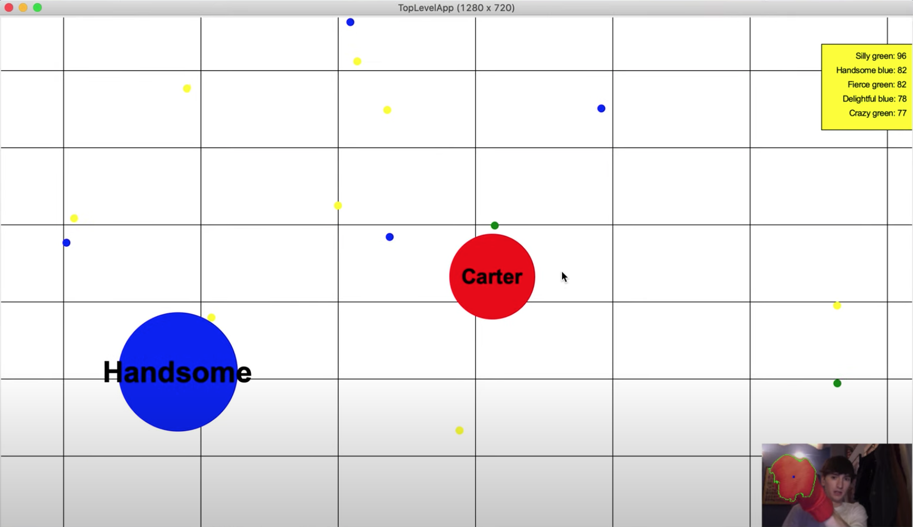

# 15-112 Term Project
OpenCV Agar: My 15-112 term project is a reimagining of the popular multiplayer game agar.io, 
in which you control your own dot as it moves throughout a map full of enemies. The goal is to 
gain size by eating smaller dots while avoiding larger dots that try to eat you. In this take on 
the game, user-controlled dots follow the player’s hand motion, which is recorded by your webcam, 
and enemy dots are controlled by an algorithm that makes decisions based on the size and distance 
of dots around them.

